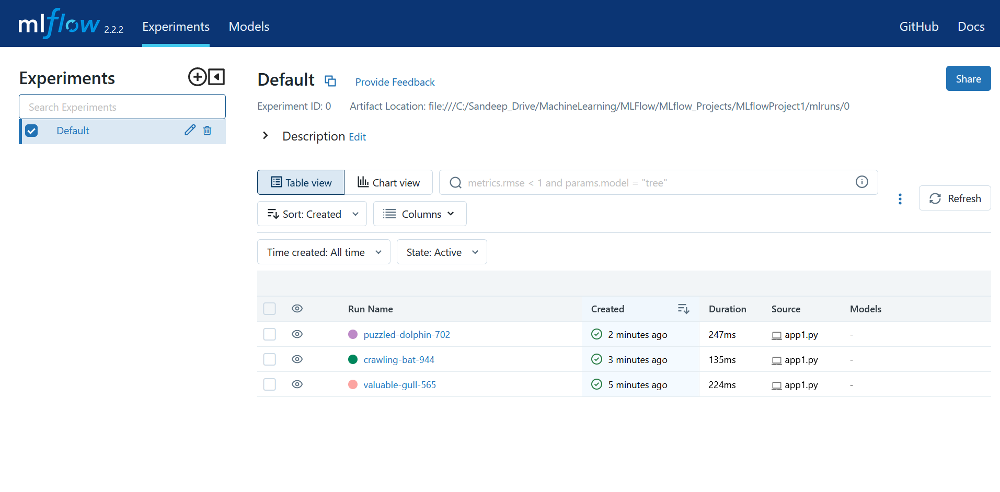
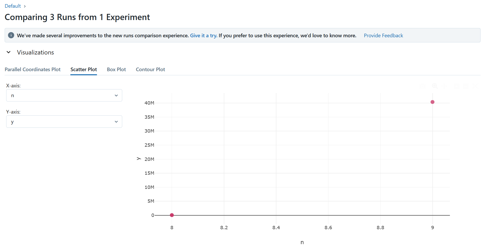
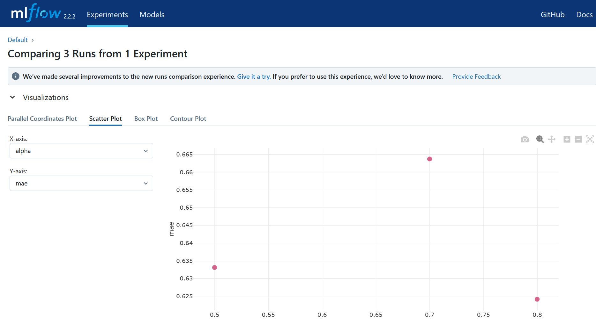
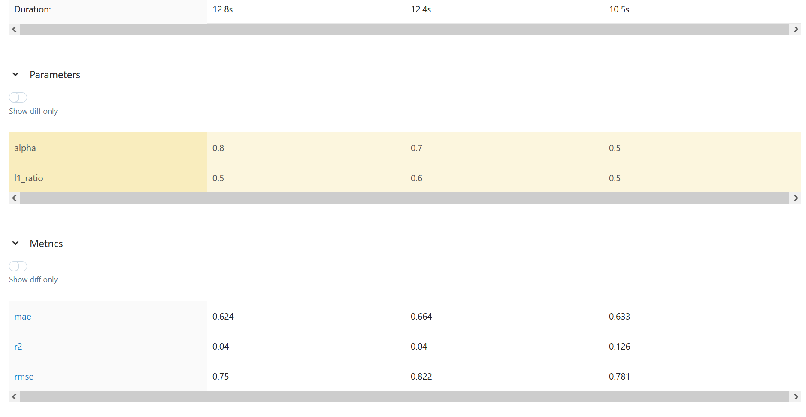

# MLFlow

## `Project 1`
This is a repo for keeping all the MLflow applications.  
Multiple projects are kept related to MLflow.

`MLProject1`: 
- This repo is having a test mlflow code to check the nth power of a number.
- The results are been shown below using command `mlflow ui` in the command line.

for comparing the results:

## `Project 2`
- used ElasticNet to train the wine-quality data.
- used -a and -l parameters to check rmse, mae, r2 in different iretion and monitoring the metrics in mlflow.
- runs.py file will help to run through all the hyperparameters and mlflow ui help to vizualize also.

Scatter plot of different alpha and l1-ration based results in terms of rmse, mae, r2.

Model parameters and Accuracy metrices can be found as below using MLflow:

## `Project 3`
- created conda.yaml file and script to run the app2.py file.
- created MLproject to auto run the script.